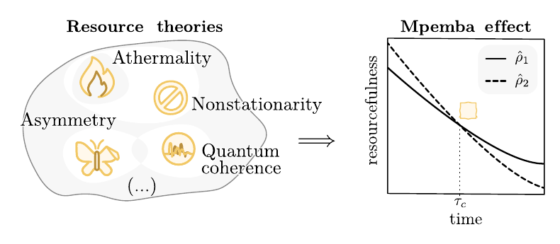

# 🧊 Resource-Theoretical Unification of Mpemba Effects

[](https://doi.org/10.1103/rbt4-psfd)
[](https://arxiv.org/abs/2507.16976)
[](https://www.python.org/)
[](tools/execute_notebooks.py)

Notebooks accompanying:

> Alessandro Summer, Mattia Moroder, Laetitia P. Bettmann, Xhek Turkeshi,
> Iman Marvian, and John Goold, **“Resource-Theoretical Unification of
> Mpemba Effects: Classical and Quantum,”** *Physical Review X* **16**,
> 011065 (2026).

**TL;DR.** We recast anomalous relaxation — the *Mpemba effect* — as
resource dissipation in a quantum resource theory. Thermal and symmetry
Mpemba effects become parallel instances of the same phenomenon: a state
that is *more resourceful* initially can lose its resource faster than a
less resourceful one, driven by its overlap with the slowest eigenmodes of
the dissipative dynamics. This repository reproduces every worked example
in the manuscript — from classical Markov chains to non-Abelian SU(2)
random circuits — end-to-end from source.

**Keywords:** Mpemba effect · resource theory · quantum thermodynamics ·
asymmetry · symmetry restoration · open quantum systems · Lindbladian
spectrum · random circuits · U(1) · SU(2) · ETH · quantum Fisher
information.



*Figure 1. A Mpemba effect occurs when the initially more resourceful state
loses its resource faster, causing the resource monotones to cross.*


## 🎯 Main contributions

- **🧩 One resource-theoretic framework for different Mpemba effects.**
  Free states and free operations determine which resource is dissipated during
  relaxation. Nonequilibrium free energy is expressed through relative entropy
  to the thermal state, while the relative entropy of asymmetry measures
  distance from the symmetry-invariant states. The thermal and symmetry Mpemba
  effects are therefore parallel instances of anomalously fast resource
  depletion: symmetry restoration is the dissipation of asymmetry.
  [Manuscript: Sec. I.1](https://arxiv.org/html/2507.16976#S1.SS1) ·
  [Sec. IV](https://arxiv.org/html/2507.16976#S4) ·
  [Walkthrough](asymm_ex6.ipynb)

- **📉 A common spectral mechanism to the thermal Mpemba effect.**
  We show that anomalous relaxation is governed by the initial state’s overlap with the eigenmodes of the dissipative map — a mechanism that has been recognised only in the thermal and nonstationary Mpemba effect by [Nava and Fabrizio](https://doi.org/10.1103/PhysRevB.100.125102) and [Carollo, Lasanta, and Lesanovsky](https://doi.org/10.1103/PhysRevLett.127.060401), a strongly symmetry-broken state can relax faster when its overlap with the slowest symmetry-restoring mode is small or vanishes.
  [Manuscript: Sec. II](https://arxiv.org/html/2507.16976#S2) ·
  [Sec. III.3](https://arxiv.org/html/2507.16976#S3.SS3) ·
  [Thermal walkthrough](atherm_ex1.ipynb) ·
  [Symmetry-mode walkthrough](asymmetry_modes_example.ipynb)

- **⚖️ The symmetry Mpemba effect is not inherently quantum.**
  It already occurs in classical Markovian systems. Entanglement can accompany particular realizations, but it is not required for the effect.
  [Manuscript: Sec. III.4](https://arxiv.org/html/2507.16976#S3.SS4) ·
  [Walkthrough](asymm_ex1.ipynb)

- **🎲 Random circuits reveal the role of modes of asymmetry.**
  In symmetry-preserving circuits, different charge modes decay at different rates. More strongly tilted initial states tend to populate Hilbert-space sectors statistically associated with faster-decaying eigenmodes, providing a mode-resolved explanation for their faster symmetry restoration.
  [Manuscript: Sec. III.7](https://arxiv.org/html/2507.16976#S3.SS7) ·
  [Markovian U(1)](asymm_ex4.ipynb) ·
  [Non-Markovian U(1)](asymm_ex4.1.a.ipynb) ·
  [Non-Abelian SU(2)](asymm_ex5.ipynb)

## 📁 Repository contents

The thirteen top-level notebooks are publication-oriented walkthroughs of the
main-text and appendix examples. Each identifies its manuscript location and
reproduction status, constructs the model, verifies the relevant structural
properties, and only then tests the Mpemba crossing. The SU(2) notebook
recomputes the five Fig. 11 curves from 100 raw full-SU(2) circuit realizations
and reproduces all ten pairwise crossings. It verifies covariance under
\(S_x,S_y,S_z\) and uses the exact non-Abelian Haar twirl.

### Appendix companions

- 🌀 [`Mpemba_nonstatioinarity.ipynb`](Mpemba_nonstatioinarity.ipynb) —
  independent reconstruction of the Appendix A nonstationarity example. Both
  initial states are generated transparently; no pickle or stored trajectory is
  used.
- ⛓️ [`Mpemba_ETH.ipynb`](Mpemba_ETH.ipynb) — manuscript-scale Appendix B
  calculation for an \(N=15\) ETH bath, including the full sparse
  \(2^{16}\)-dimensional unitary evolution and Rényi crossing-time inset.
- 📐 [`Mpemba_QFI_monotone.ipynb`](Mpemba_QFI_monotone.ipynb) — exact Appendix
  QFI reconstruction showing crossings for SLD and Wigner-Yanase metrics but
  no crossing for the harmonic-mean metric.
- [`NOTEBOOKS.md`](NOTEBOOKS.md) gives the recommended reading order and maps
  every notebook to the relevant manuscript section and figure.
- [`asymmetry_and_mpemba/`](asymmetry_and_mpemba/) contains the original manuscript-analysis material and figure-generation code.
- [`tools/notebook_utils.py`](tools/notebook_utils.py) contains shared numerical routines.
- [`tools/circuit_data.py`](tools/circuit_data.py) implements the reproducible random-circuit simulations.
- [`data/circuit_examples/`](data/circuit_examples/) contains raw, per-realization circuit data rather than fitted or illustrative curves.
- [`tools/`](tools/) contains notebook builders, data generators, and the top-to-bottom execution check.

## ▶️ Running the notebooks

The notebooks require Python 3 with NumPy, SciPy, Matplotlib, `nbformat`, and `nbclient`. Run commands from the repository root.

To execute every notebook and refresh its stored outputs:

```bash
python tools/execute_notebooks.py
```

To rebuild and execute only the appendix companions:

```bash
python tools/build_publishable_notebooks.py \
  Mpemba_nonstatioinarity.ipynb Mpemba_ETH.ipynb Mpemba_QFI_monotone.ipynb
python tools/execute_notebooks.py \
  Mpemba_nonstatioinarity.ipynb Mpemba_ETH.ipynb Mpemba_QFI_monotone.ipynb
```

To rebuild the publishable notebooks, regenerate the standard circuit datasets, and execute everything:

```bash
python tools/build_publishable_notebooks.py
python tools/generate_circuit_data.py
python tools/execute_notebooks.py
```

The exact-size non-Markovian U(1) reference dataset uses archived gate parameters from the companion repository. Rebuild it with:

```bash
python tools/generate_circuit_data.py \
  --only u1-reference \
  --paper-scale \
  --reference-checkout /path/to/mpemba_circuits
```

The generator verifies the upstream parameter file by SHA-256 before running.
The exact occupied-U(1)-sector engine evolves each charge sector once, reuses
it for all five tilts, and parallelizes independent circuits. The stored file
contains the complete 100-circuit, 1000-layer Fig. 10 calculation.

## 📊 Circuit-data scope

The stored data are deliberately explicit about their statistical scope:

- Fig. 9 uses the manuscript system and ensemble size.
- The non-Markovian U(1) walkthrough uses the complete 100-circuit
  \(N_s=8,N_e=12\), 1000-layer archived-parameter ensemble. The smaller
  24-circuit \(N_s=4,N_e=8\) file is retained only for the explicit channel
  audit of Marvian--Spekkens Eq. (3.10).
- The SU(2) walkthrough uses the manuscript Hilbert-space size \(N_s=8,N_e=12\)
  and the full 100-realization ensemble. It evolves isotropic partial-SWAP
  gates with an invariant singlet bath and computes asymmetry with the exact
  SU(2) Schur-basis Haar twirl. The notebook explicitly records the
  figure-matching initial-angle and time-axis conventions because those
  conventions are absent from the archived raw data. It does not use the
  companion repository's U(1) execution path.

Reduced local ensembles are never presented as replacements for the 100-realization manuscript averages.

## 📚 Citation

```bibtex
@article{Summer2026Mpemba,
  title   = {Resource-Theoretical Unification of Mpemba Effects:
             Classical and Quantum},
  author  = {Summer, Alessandro and Moroder, Mattia and Bettmann,
             Laetitia P. and Turkeshi, Xhek and Marvian, Iman and
             Goold, John},
  journal = {Physical Review X},
  volume  = {16},
  pages   = {011065},
  year    = {2026},
  doi     = {10.1103/rbt4-psfd}
}
```
